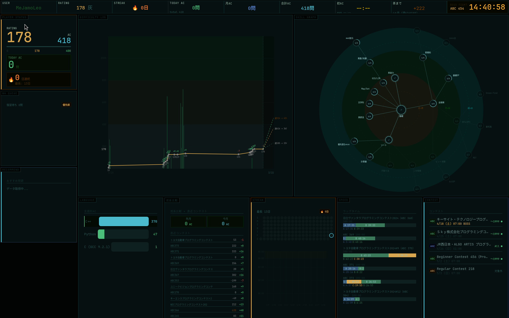

# nixos-cp

[日本語](README.ja.md)

AtCoder competitive programming environment on NixOS. Dashboard on your desktop background, terminal-first workflow from practice to submission.



## What is this

A NixOS flake that turns your machine into a competitive programming workstation:

- **Dashboard** — always-visible on your Sway desktop background. Rating history, skill tree, streak calendar, contest results. Updates automatically as you solve problems.
- **CLI tools** — `cp-go` picks a problem, opens your editor and browser. Write, test, submit without leaving the terminal. Insight journal after every submission.
- **Spaced repetition** — SRS tracks problems you struggled with and brings them back at optimal intervals.
- **Neovim** — LSP, completion, and in-editor test runner (competitest). Fully declarative via nixvim.
- **Everything reproducible** — one `nixos-rebuild switch` sets up the entire environment.

## Quick Start

### Prerequisites

- NixOS with flakes enabled
- Sway window manager (for full/x1nano tiers)

### 1. Clone and configure

```bash
git clone https://github.com/MeJamoLeo/nixos-cp.git
cd nixos-cp
```

Edit `dashboard/watchlist.json` with your AtCoder username:

```json
["YourUsername"]
```

### 2. Choose your tier and build

```bash
# CLI tools + dashboard only (bring your own editor/browser)
sudo nixos-rebuild switch --flake .#minimal

# Full GUI: minimal + Neovim + Firefox + Sway + fcitx5
sudo nixos-rebuild switch --flake .#full

# X1 Nano Gen2: full + nixos-hardware (TLP/thermald/microcode/fwupd) + fingerprint
sudo nixos-rebuild switch --flake .#x1nano
```

For `minimal` and `full`, you need to provide your own `hardware-configuration.nix`:

```bash
sudo nixos-generate-config --show-hardware-config > hosts/minimal/hardware-configuration.nix
# Then add it to hosts/minimal/configuration.nix imports
```

### 3. Login to AtCoder

```bash
cp-login
```

Open Firefox, log into AtCoder, copy `REVEL_SESSION` cookie from DevTools, paste it.

### 4. Start practicing

```bash
cp-go
# or press Super+G (full/x1nano only)
```

That's it. A problem is selected, browser opens the problem page, nvim opens with your solution file.

## Configuration Tiers

| Tier | What's included |
|------|----------------|
| **minimal** | Dashboard + CLI tools (cp-go, cp-submit, etc). No editor, no browser, no WM. |
| **full** | minimal + Neovim (nixvim) + Firefox + Sway + fcitx5 + wofi + fonts |
| **x1nano** | full + nixos-hardware (X1 Nano Gen2) + fingerprint auth |

## Dashboard Panels

| Panel | What it shows |
|-------|--------------|
| **HUD** | Rating, streak, today's AC count, next color estimate |
| **Difficulty Log** | Weekly practice volume (bars) + rating history (line) + 3-month projection |
| **Skill Graph** | Radial skill tree based on benchmark problem ACs (Typical 90, EDPC, ABC) |
| **Streak** | GitHub-style 20-week calendar + 10-day time scatter |
| **Insight** | Latest insight note from your journal |
| **Speed** | Lap times per contest (A/B/C/D split) |
| **Compare** | Monthly AC comparison + recent contest perf/delta |
| **Language** | AC count by programming language |

Data updates every 2 minutes from AtCoder/kenkoooo APIs.

## CLI Tools

```bash
cp-go              # Auto-select problem → browser + nvim → test → submit → insight
cp-new abc453      # Set up contest directory with all problems
cp-submit main.py  # Copy to clipboard + open submit page (or auto-submit during contests)
cp-finish main.py  # Test → submit → result → insight (called by cp-go)
cp-review abc453   # Post-contest review: tag + insight per problem
cp-srs             # Spaced repetition: review schedule, record results
cp-demo            # Try the full workflow with a fixed easy problem
cp-login           # Set AtCoder session cookie
```

## Practice Workflow

`cp-go` runs a continuous practice session:

1. **Warmup** — an easy problem from your AC'd difficulty range (1st problem, then every 3rd)
2. **Main** — selected by priority: SRS review due → WA retry → skill tree benchmark
3. **After solving** — test locally → submit → record result → write insight (optional)
4. **SRS** — problems you skip or fail are scheduled for review (1→3→7→14→30 day intervals)

## Neovim Keybindings

| Key | Action |
|-----|--------|
| `Space+cr` | Run test cases (competitest) |
| `Space+cs` | Save + submit |
| `-` | File explorer (oil.nvim) |
| `Space` | Show all keybindings (which-key) |
| `gd` | Go to definition |
| `K` | Hover docs |

## Watchlist

View other users' dashboards:

```bash
# Edit watchlist
vim dashboard/watchlist.json    # ["YourName", "friend1", "friend2"]

# Cycle through users
Super+`
```

## Project Structure

```
├── flake.nix                   # NixOS flake (minimal/full/x1nano)
├── profiles/
│   ├── minimal/                # Base: CLI tools + dashboard
│   └── full/                   # GUI: Sway + Neovim + Firefox + fcitx5
├── hosts/
│   ├── minimal/                # Host wrapper for generic minimal deploy
│   ├── full/                   # Host wrapper for generic full deploy
│   └── x1nano/                # X1 Nano Gen2 specific (hardware-configuration, fingerprint)
├── modules/
│   ├── sway.nix                # Sway WM config (keybindings, input, startup)
│   └── nvim/                   # Neovim config (nixvim)
├── home/                       # Shared home-manager modules (shell, git, starship)
├── dashboard/
│   ├── dashboard.py            # GTK4 + WebKit6 renderer
│   ├── fetch_stats.py          # AtCoder/kenkoooo API data fetcher
│   ├── dashboard.html          # CSS layout
│   └── js/                     # Modular JS (difficulty-log, streak, skill-graph, etc.)
└── tools/                      # CLI tools (cp-go, cp-submit, cp-new, etc.)
```

## Customization

### Change target user

Edit `dashboard/watchlist.json`. The first entry is the primary user.

### Add keybindings

Edit `modules/sway.nix`. Current modifier is `Super` (Mod4).

### Modify dashboard panels

Each panel is a separate JS file in `dashboard/js/`. Edit independently.

### Adjust skill tree

Benchmark problems are defined in `dashboard/fetch_stats.py` under `BENCHMARKS`. Add or replace problems per skill node.

## How the prediction works

The dashboard shows 3-month rating projections based on your weekly practice volume:

- **Efficiency decreases with rating** — smooth exponential decay calibrated from color-change article statistics
- **Band targets** — "to reach the next color in 3 months, you need X diff/week"
- **Contest mode** — during live contests, detects active contest and enables auto-submission via curl

## License

MIT
