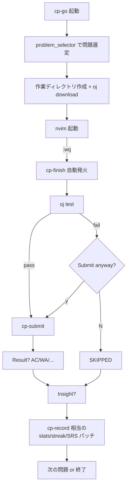
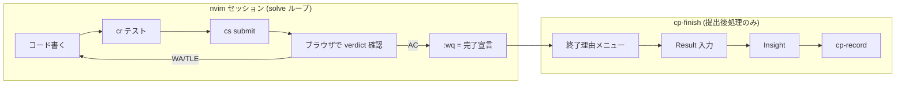
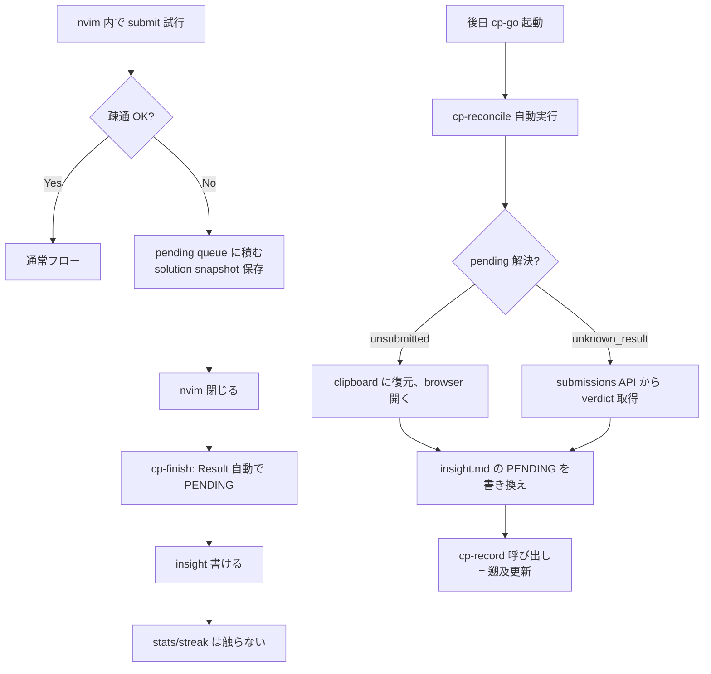
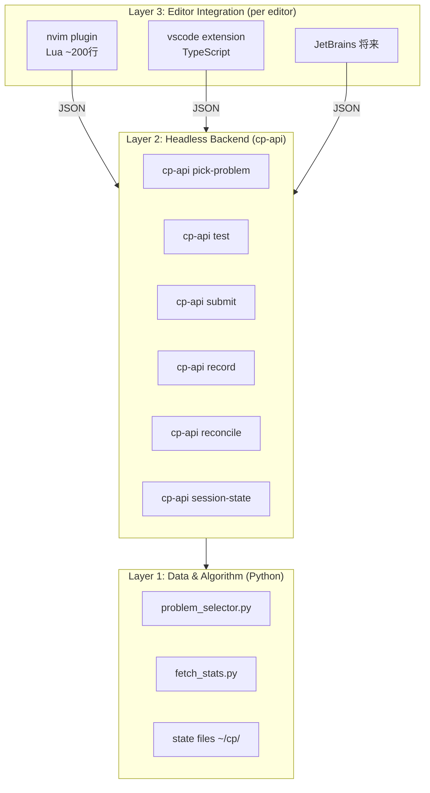
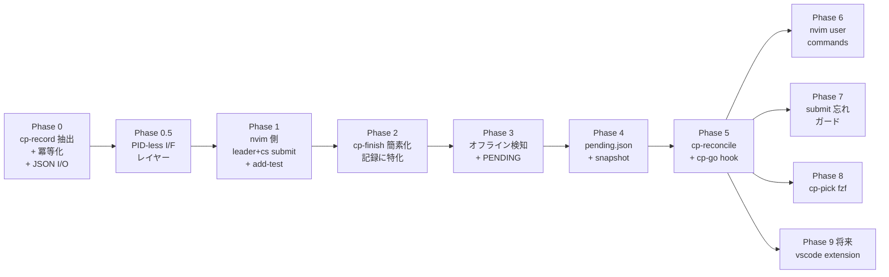

# cp-go / cp-finish 再設計 議論メモ (2026-04-23)

## 発端

insight の弱点: オフライン時に提出できない → 結果がわからない → insight が書けない。
結果、「insight を書く」という行為を「提出」と分離すべきか、という問い。

派生して以下を議論:
- 提出・結果・insight の分離
- session 概念と streak/stats の関係
- PID 中心 I/F の問題
- 中断/スキップ/諦めのシナリオ設計
- 「解けた」→ 実は WA だった時の復帰ルート
- エディタ中心モデルへの転換
- VSCode 対応を含む配布時のアーキテクチャ

---

## 現状の流れ



### 観察された痛み

| # | 場面 | 問題 |
|---|------|------|
| A | オフライン時 | submit 失敗 → 結果入力できない → insight ヘッダが不正確 |
| B | 結果手入力 | ブラウザ目視 → タイポ・記憶違い |
| C | insight スキップ時 | 後で書きたくなっても入り口がない |
| D | アーカイブ解答 | insight エントリとの対応付けなし |
| E | stats patch | `cp-finish` の末尾で直接書く、結果訂正時の口なし + 冪等でない |

---

## Session と streak/stats の関係

**質問**: 1日に 2 セッション×1問ずつやったら 1問か?

**結論**: 2問。

- `SESSION_COUNT` = その回の UI 表示用 ephemeral 値
- `streak_calendar` / `hud.today_ac` = 日付ベースの永続データ
- `cp-finish:216` `hud['today_ac'] += 1` は累積加算 → session 越えても正しく積む

**ただし現状に潜在バグ**: `today_ac` と `streak_calendar.ac_count` に idempotency がない。同じ PID で `cp-finish` が 2回走ると二重加算。

→ `cp-record` 抽出 + 冪等化が前提条件。

---

## エディタ中心モデル (採用方針)

### 発想の転換

「`cp-go` が nvim を開く → 閉じたら `cp-finish`」は、**エディタ終了をトリガーに使っている** のが問題。

- 失敗時に戻れない (`:wq` は一方通行)
- test/submit が bash 側にあるせいで、nvim 内で iterate するループと重複
- 多エディタ対応の障害になる

### 新しい責務分担



### nvim を閉じる = 「この問題は終わった」という完了宣言

- test/submit は **エディタ内で既に済んでいる前提**
- `cp-finish` は記録に特化 (test/submit のロジックを削除)
- 失敗時の復帰は **nvim の中で iterate** するので、エディタ終了後には発生しない

### nvim 終了後のメニュー

```
──── abc400_a 終了 ────
  [Enter] 記録する (insight + stats)
  [p]     中断 = 後で続ける (記録なし)
  [s]     スキップ = 記録なし、次問題
  [q]     セッション終了
```

- **デフォルト Enter = 95% の正解**
- ファイル内センチネル (`# PAUSE` 等) は却下 (言語依存 + 非 discoverable)
- メニュー自体が取説になる

### Result 入力後の verdict 別挙動

AC なら直接 insight へ。WA/TLE/RE なら:

```
Result: WA

ヒント: 境界条件を疑う (N=1, all-same, 最大値, overflow)

  [Enter] nvim に戻って直す
  [t]     失敗ケースを追加してから nvim に戻る
  [i]     insight だけ書いて次へ (pending)
  [n]     次の問題へ (後で cp-retry)
  [q]     終了
```

**ローカル pass → 提出 NG** はセミ上級者の失敗モードの 8割。この復帰ルートが肝。

### verdict 別ヒント

| verdict | ヒント |
|---|---|
| WA | 境界条件を疑う: N=1, all-same, 最大値, overflow |
| TLE | 計算量: 現在の実装は O(?)。制約から逆算 |
| RE | index out of range, div by zero, recursion depth |
| MLE | 配列サイズ、再帰、メモ化の上限 |

固定文字列でいい。頭が白くなった時の thinking trigger。

---

## オフライン対応 (PENDING)

### 設計

**「提出の確定」「結果の確定」「insight の記録」を 3つ独立させる。**



### pending queue フォーマット

```json
[
  {
    "pid": "abc400_a",
    "url": "https://atcoder.jp/contests/abc400/tasks/abc400_a",
    "solution_snapshot": "/home/treo/cp/contests/abc400/a/.pending.20260423T0815.main.py",
    "timestamp": 1714000000,
    "state": "unsubmitted"
  }
]
```

- `unsubmitted`: オフラインで送れなかった
- `unknown_result`: 送ったが verdict 未取得
- snapshot を取る理由: 次問題に進むと `cp-go` が main.py をアーカイブ & 空に → 再 submit 時に必要

---

## PID-less I/F

### 問題

- PID (`abc400_a`) は内部識別子、ユーザー語彙じゃない
- ユーザーは nvim live_grep で「前書いた関数名」で navigation している
- コマンドの第一引数を PID にすると使い物にならない

### 規約

全コマンドは以下の優先順で対象問題を決定:

1. 引数にファイルパスが渡されていればそれ
2. CWD が `~/cp/contests/*/*/` の下なら CWD
3. pending queue の最新エントリ
4. fzf picker で選択

**PID を直接タイプする経路は用意しない。**

### nvim 側の糊

```vim
command! CpInsight !cp-insight %
command! -nargs=1 CpResult !cp-result % <args>
command! CpRetry !cp-retry %
```

動線:
1. `<leader>fg` で `segment_tree_update` を live_grep
2. 見つかった main.py にジャンプ
3. `:CpInsight` → 対応する insight.md が開く

PID を一度もタイプしない。

---

## 想定シナリオ

### シナリオ 1: 朝のルーティン (オンライン)

1. 起きてターミナル、`cp-go`
2. warmup + main 連続、1問ごとに `<leader>cr` → `<leader>cs` → `:wq` → 記録
3. 疲れたら `q`

### シナリオ 2: 電車 (オフライン)

1. `cp-go` → 疎通チェック NG → 既 download 済み pool から選ぶ
2. 解く → `<leader>cs` 試行 → offline 検知 → pending queue に積む
3. `:wq` → 自動 PENDING → insight 書ける
4. stats/streak は未更新

### シナリオ 3: 帰宅後 reconcile

1. `cp-go` 起動 (または明示的に `cp-reconcile`)
2. pending 3件を自動解決 (`unknown_result` は API、`unsubmitted` はユーザー操作)
3. verdict 確定 → insight 書き換え → cp-record 遡及
4. "3件 reconcile しました (AC:2, WA:1)"

### シナリオ 4: 心折れた

1. 問題読んで無理と判断
2. `:wq` → 終了理由メニューで `s` (skip) または `p` (pause)
3. skip なら SKIP_PIDS 追加、pause なら bookmark して次回再開

### シナリオ 5: 過去の類題参照

1. nvim で `<leader>fg` → 関数名で検索
2. 過去の main.py にジャンプ
3. `:CpInsight` → 過去の学びを読む

### シナリオ 6: コンテスト本番

1. `.contest_mode` flag
2. insight 即時プロンプト無し、submit は curl 直接
3. 事後 `cp-review abc400` で全問 review

### シナリオ 7: 週末まとめ insight

1. `cp-pick` (fzf) で recent 20問を preview 付き眺め
2. 気になる問題の insight を追記

---

## 配布戦略 (VSCode 対応)

### 3層アーキテクチャ



**Layer 1-2 が配布本体。Layer 3 は薄い。**

### cp-api 契約例

```bash
$ cp-api pick-problem --mode=main --format=json
{
  "pid": "abc400_a",
  "url": "https://...",
  "solution_path": "/home/user/cp/contests/abc400/a/main.py",
  "suggested_tag": "尺取り法"
}

$ cp-api test <file> --format=json
{"passed": false, "cases": [{"name":"sample_2","status":"WA",...}]}

$ cp-api submit <file> --format=json
{"mode":"practice","opened_browser":"...","offline":false,"pending_queued":false}
```

### VSCode "rich demo" の UX

視覚的に強い要素を活用:

- **アクティビティバー**: CP アイコン → pending queue / recent / insights by tag の tree view
- **ステータスバー**: `🔥 7 day streak  •  today: 3 AC  •  abc400_a (solving)`
- **右サイドパネル**: AtCoder の問題 HTML を webview で表示 (KaTeX 付き)
- **下パネル**: テストランナー (input/expected/actual の diff)
- **コマンドパレット**: `CP: Start Session`, `CP: Test`, `CP: Submit`
- **Insight webview**: Markdown + KaTeX preview 併置、タグ chips UI
- **通知**: offline queue、reconcile 成功、streak 危機

### パッケージング

- **Nix flake** (主): `nix run github:user/nixos-cp` で `cp-api` + nvim plugin
- **VSCode extension** (副): marketplace、`cp-api` を post-install で Nix 経由で入れる

### 規律

Phase 0 の `cp-record` を作る時、**最初から JSON in/out 対応**:

```bash
cp-record --json '{"pid":"abc400_a","result":"AC"}'
→ {"updated":true,"streak":5,"today_ac":3}
```

bash からは jq で整形、vscode 拡張からは stdin/stdout。小さい規律で将来の VSCode 対応がほぼ無料になる。

---

## Phase 計画



### 優先度の根拠

- **P0 が前提**: `cp-record` を冪等化しないと、reconcile で二重加算のバグが露呈する
- **P0.5 が早い段階**: pending.json のスキーマに影響する (pid + path 両持ち)
- **P1-2 が本丸**: エディタ中心モデルへの転換
- **P3-5 で A (オフライン) が完全解決**
- **P9 は P0 の JSON 規律を守っていれば純粋追加**

### 却下した設計

- ファイル先頭センチネル (`# PAUSE` / `# SKIP`): 言語依存、non-discoverable
- 完全分離 (全コマンド手動): insight 書かない病、認知負荷、session 概念の死
- cp-finish の途中キャンセル全箇所対応: 過剰、失敗ゲート 2箇所で十分
- LSP サーバー化: daemonless で十分
- 独自プロトコル (Protobuf 等): JSON で足りる

---

## 要確認事項

- 朝/電車のオフライン問題: 前日 `oj download` 習慣はあるか? 無ければ `cp-prefetch` が必要
- contest mode の使用頻度
- 「解き始めて諦める」頻度 (PAUSE/SKIP 設計の重要度を決める)
- streak カウントのズレの実際の発生有無 (冪等性バグの症状として)

---

## 次のアクション

Phase 0 (`cp-record` 抽出 + 冪等化 + JSON I/O) から着手。既存バグ修正も兼ねるため、作業前に `~/cp/local_ac.json` および `~/.cache/cp-dashboard/stats_${USER}.json` のバックアップを取る。
