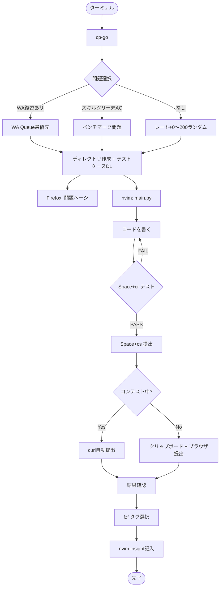
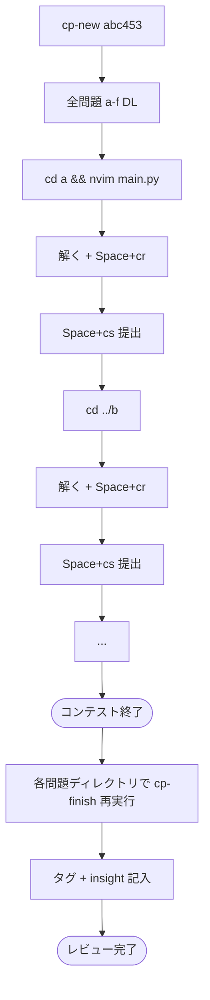
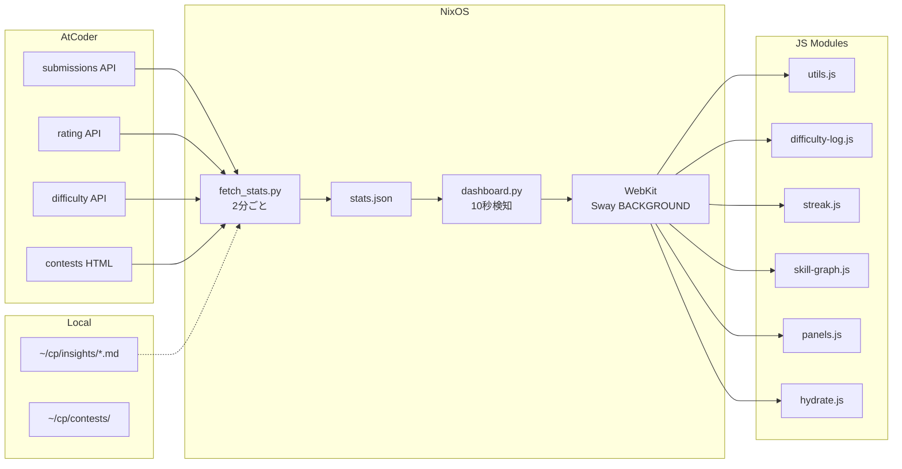
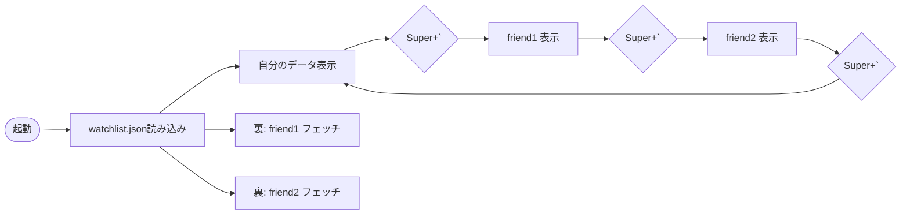

# nixos-cp Workflow

## 精進フロー



## コンテストフロー



## データフロー



## ユーザー切り替え



## 予測モデル

```mermaid
flowchart TD
    subgraph Input
        WEEKLY[週diff総和]
        RATING[現在レート]
        PERFS[コンテストperf履歴]
    end
    
    subgraph Model
        EFF[滑らかな効率曲線<br>0.03 × e^{-rating/550}]
        CONV[収束レート<br>指数加重平均 decay=0.9]
        PACE[ペース目標<br>3ヶ月/6ヶ月で次の色]
    end
    
    subgraph Output
        PROJ[予測線 3本<br>楽観/維持/悲観]
        GHOST[ゴーストバー<br>今週の目標diff]
        TARGET[次の色まで<br>推定X ヶ月]
    end
    
    WEEKLY --> EFF
    RATING --> EFF
    EFF --> PROJ
    EFF --> GHOST
    EFF --> TARGET
    PERFS --> CONV
    WEEKLY --> PACE
    RATING --> PACE
    PACE --> TARGET
```
